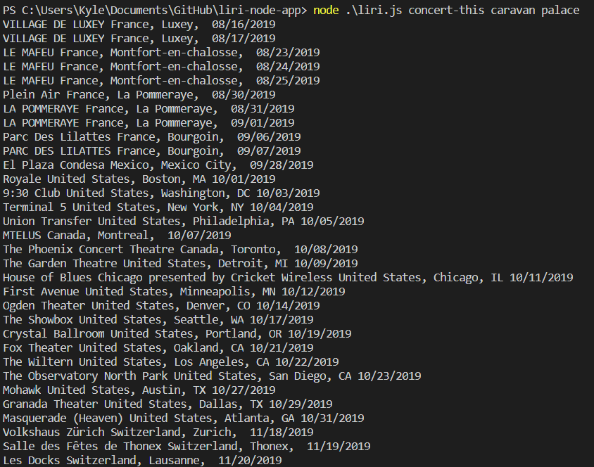
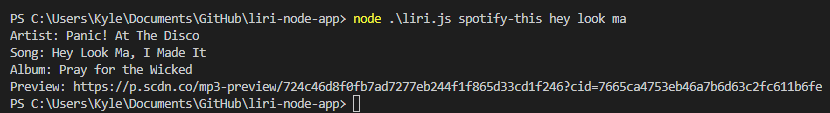
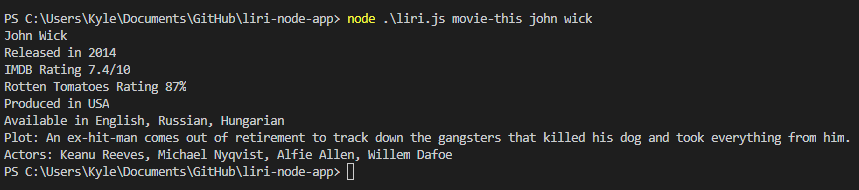
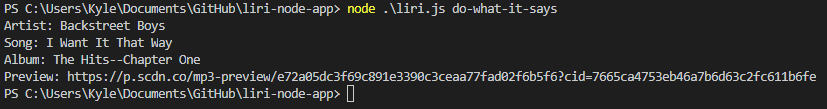
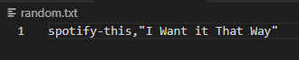

# LIRI Node.js app
> language interpretation and recognition interface

Welcome to an app based entirely in the command line. No browser needed.

This is a one-stop shop to browse various media and obtain information you're looking for with simple commands.

### developer keys must be obtained seperately
___

## Three ways to run the app.

### concert-this

### spotify-this 

### movie-this

### One way to mess around.

#### do-what-it-says

* will read the from the random.txt file and run the pre-set command

---

## uses the following node packages

* axios
* dotenv
* node-spotify-api
* moment
* eslint

## updates pending

* logging every command to the log.txt file